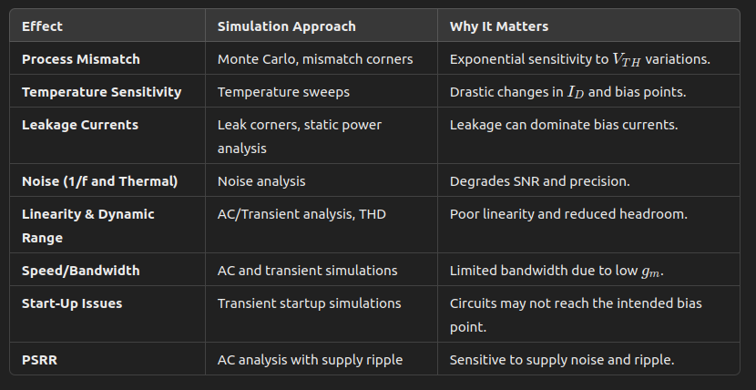

## Corners
For ULP

Dir: 
```
sky130A/libs.ref/sky130_fd_pr/spice/
```
Example: 
```
nfet_01v8_lvt
```

```
sky130_fd_pr__nfet_01v8_lvt.pm3.spice

sky130_fd_pr__nfet_01v8_lvt__ff.corner.spice
sky130_fd_pr__nfet_01v8_lvt__ff_discrete.corner.spice
sky130_fd_pr__nfet_01v8_lvt__ff.pm3.spice

sky130_fd_pr__nfet_01v8_lvt__fs.corner.spice
sky130_fd_pr__nfet_01v8_lvt__fs_discrete.corner.spice
sky130_fd_pr__nfet_01v8_lvt__fs.pm3.spice

sky130_fd_pr__nfet_01v8_lvt__leak.corner.spice
sky130_fd_pr__nfet_01v8_lvt__leak_discrete.corner.spice
sky130_fd_pr__nfet_01v8_lvt__leak.pm3.spice

sky130_fd_pr__nfet_01v8_lvt__mismatch.corner.spice

sky130_fd_pr__nfet_01v8_lvt__sf.corner.spice
sky130_fd_pr__nfet_01v8_lvt__sf_discrete.corner.spice
sky130_fd_pr__nfet_01v8_lvt__sf.pm3.spice

sky130_fd_pr__nfet_01v8_lvt__ss.corner.spice
sky130_fd_pr__nfet_01v8_lvt__ss_discrete.corner.spice
sky130_fd_pr__nfet_01v8_lvt__ss.pm3.spice

sky130_fd_pr__nfet_01v8_lvt__subvt_mismatch.corner.spice

sky130_fd_pr__nfet_01v8_lvt__tt.corner.spice
sky130_fd_pr__nfet_01v8_lvt__tt_correln.corner.spice
sky130_fd_pr__nfet_01v8_lvt__tt_correlp.corner.spice
sky130_fd_pr__nfet_01v8_lvt__tt_discrete.corner.spice
sky130_fd_pr__nfet_01v8_lvt__tt_leak.corner.spice
sky130_fd_pr__nfet_01v8_lvt__tt_leak_discrete.corner.spice
sky130_fd_pr__nfet_01v8_lvt__tt_leak.pm3.spice
sky130_fd_pr__nfet_01v8_lvt__tt.pm3.spice

sky130_fd_pr__nfet_01v8_lvt__wafer.corner.spice

```

```
sky130_fd_pr__nfet_01v8__ff.corner.spice
sky130_fd_pr__nfet_01v8__ff.pm3.spice
sky130_fd_pr__nfet_01v8__fs.corner.spice
sky130_fd_pr__nfet_01v8__fs.pm3.spice
sky130_fd_pr__nfet_01v8__leak.corner.spice
sky130_fd_pr__nfet_01v8__leak.pm3.spice
sky130_fd_pr__nfet_01v8__mismatch.corner.spice
sky130_fd_pr__nfet_01v8.pm3.spice
sky130_fd_pr__nfet_01v8__sf.corner.spice
sky130_fd_pr__nfet_01v8__sf.pm3.spice
sky130_fd_pr__nfet_01v8__ss.corner.spice
sky130_fd_pr__nfet_01v8__ss.pm3.spice
sky130_fd_pr__nfet_01v8__subvt_mismatch.corner.spice
sky130_fd_pr__nfet_01v8__tt.corner.spice
sky130_fd_pr__nfet_01v8__tt_correln.corner.spice
sky130_fd_pr__nfet_01v8__tt_correlp.corner.spice
sky130_fd_pr__nfet_01v8__tt_leak.corner.spice
sky130_fd_pr__nfet_01v8__tt_leak.pm3.spice
sky130_fd_pr__nfet_01v8__tt.pm3.spice
sky130_fd_pr__nfet_01v8__wafer.corner.spice
```


The LVT has more corners
### explanation

```
			Corners
__________________________________________________

TT = Typical-Typical
FF = Fast-Fast
SS = Slow-Slow
FS = Fast-nmos, Slow-pmos
SF = Slow-nmos, Fast-pmos 
_____________________________
leak = Max leakage corner 
		--> Worst-case for static power consumption 

mismatch = Adds random device mismatch (e.g. Vth variations) 
		--> Tests worst-case mismatch for analog or RF circuits

subvt_mismatch = Mismatch focused on subthreshold region operation 
		--> Important for ultra-low-power or subthreshold circuits     <---- !!!

wafer = Simulates wafer-level process variation 
		--> Not so important for MPW or TinyTapeout I think
_____________________________
.pm3.spice = SPICE model files including parasitics
		--> Detailed transistor-level simulations

.corner = Standard process corner definitions 
		--> Regular corner simulations
		--> For circuit-level simulations (e.g., an oscillator, amplifier).

_discrete.corner = Discrete device-focused corners
		--> Simulates individual or standalone devices rather than full IC-level circuits.
		--> For device characterization (e.g., plotting ID​ vs. VGS,  extracting VTH​, gm).


_____________________________
Usage
_____________________________

Digital Circuits:

    Simulate across FF, SS, and TT to cover best-case, worst-case, and nominal performance.
    Use leak corners to verify static power consumption.

Analog Circuits:

    Include mismatch and subvt_mismatch to ensure proper operation despite device mismatches.
    Run FS/SF to check for skewed device characteristics affecting gain, offset, etc.

Ultra-Low-Power Designs:

    Pay special attention to leak, subvt_mismatch, and wafer corners, as leakage and threshold variations are critical.


_____________________________
nfet_01v8_lvt
_____________________________


.pm3.spice


mismatch.corner.
subvt_mismatch.corner.
wafer.corner.


leak.corner.
leak_discrete.corner.
leak.pm3.


tt.corner.
tt_discrete.corner.
tt.pm3.

tt_correln.corner. <------------------ ???
tt_correlp.corner. <------------------ ???

tt_leak.corner.  <------------------ ???
tt_leak_discrete.corner. <------------------ ???
tt_leak.pm3. <------------------ ???


ff.corner.
ff_discrete.corner.
ff.pm3.

fs.corner.
fs_discrete.corner.
fs.pm3.


sf.corner.
sf_discrete.corner.
sf.pm3.

ss.corner.
ss_discrete.corner.
ss.pm3.

```
