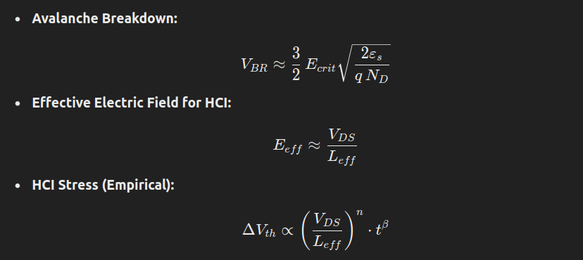
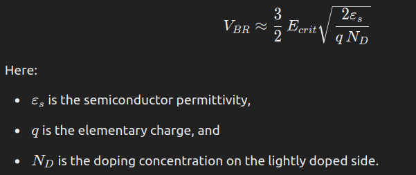
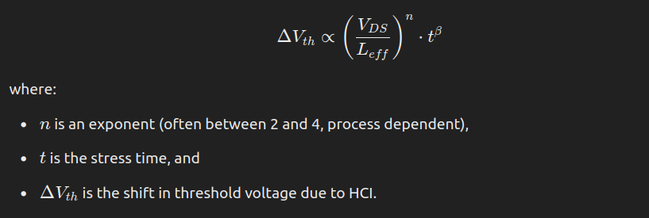

# Overview
```
Respect process limits given by the PDK.
```
```
Rely on simplified models for preliminary estimation, then verify with SPICE-based simulations and layout-aware thermal/current analyses.
```



```
Design with margins by avoiding biasing conditions that force very high E_eff.
```


```
Avoid operating devices near the extreme saturation region where the effective channel length is very short.
```

```
Bias devices such that EeffEeff​ stays below the critical level (use the rough guideline Eeff=VDS/Leff​ and compare with known safe field values for your process).
```

```
For digital circuits, since the gate only draws transient current, the focus is on the conduction path in the channel. For analog or linear circuits, biasing away from deep saturation is key.
```


<br>
<br>
<br>
<br>
<br>
<br>
<br>

# Layout
## Avalanche Breakdown

```
The critical electric field (E_crit) is mainly fixed by the process (via N_D and ε_s​) and does not strongly depend on the drawn channel dimensions.

This means that, from a chip designer’s perspective, avalanche breakdown voltage is “set” by the PDK—but layout choices (like rounding corners or adding guard rings) can help reduce local field enhancements.

TL;DR
Use round corners and extra spacing to reduce Avalanche-Breakdown.
```
## Maximum Current Conduction Areas (Heat Dissipation)

```
The key conduction paths are in the channel and source/drain (diffusion/contact) regions—not the gate metal.

For calculating maximum current, you determine an allowable current density and then multiply by the effective conduction area. For a MOSFET, this effective area might be defined by the width of the channel or the area of the diffusion/contact regions where current crowding occurs.

TL;DR
Increase Heat-Dissipation capabilities by increasing the Drain, Source/Bulk metal contacts!
```
## HCI (Hot Carrier Injection)
### Rough Equations for Estimating HCI Stress
A very simplified empirical model for HCI degradation might look like:

For rough design estimates, you can use:

and compare that value against a “safe” field value (often provided as a guideline or determined empirically for your process, e.g., on the order of 1–2 MV/cm). If your design forces EpeakEpeak​ significantly above that level, you may need to adjust biasing or device sizing.

```
HCI is primarily driven by high electric fields—especially where the effective channel length shrinks (e.g., in saturation or near pinch-off).

Temperature increases the rate of HCI damage, but the local electric field is the main factor.

In your design, you want to avoid bias conditions where a large Vds is dropped over a very short L_eff​. This is often the case in deep saturation or if the transistor is used as a load with full Vdd​ applied.

TL;DR
Don't operate right at pinch-off. Go deeper in saturation.
```


